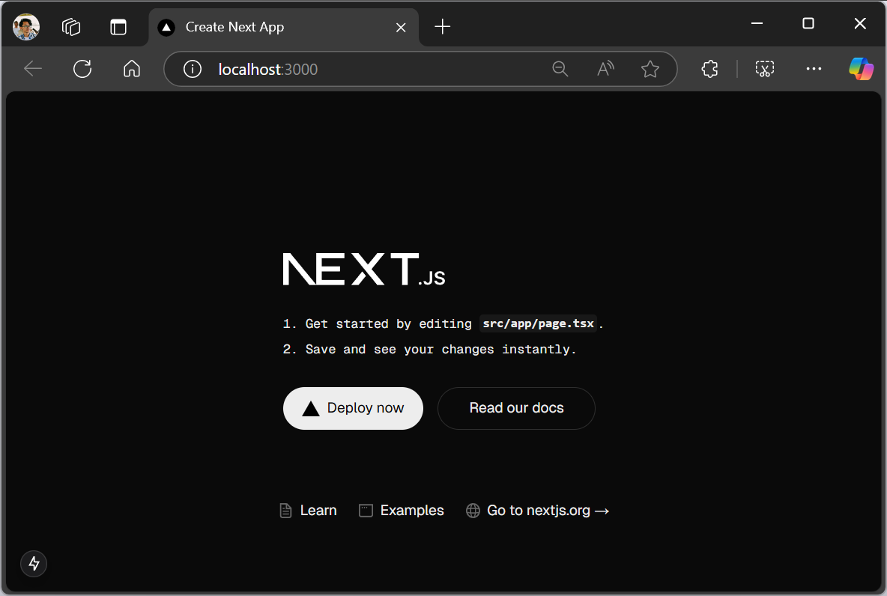

# 01 - PENGANTAR PEMROGRAMAN BERBASIS FRAMEWORK DAN REACTJS
Nama: Ahmad Taufiq Hidayatulloh  
NIM: 2241720207  
Kelas: TI-3C

## Praktikum 1: Menyiapkan Lingkungan Pengembangan
### Soal 1
Jelaskan kegunaan masing-masing dari Git, VS Code dan NodeJS yang telah Anda install pada sesi praktikum ini!  
*Jawaban*: 
- Git adalah sistem version control yang membantu melacak perubahan kode, memungkinkan kolaborasi tim, serta mempermudah pengelolaan branch dan merge.
- VS Code adalah kode editor yang berfungsi untuk penulisan kode program dari berbagai bahasa pemrograman. debugging, dan integrasi Git.
- Node.js adalah runtime JavaScript yang memungkinkan eksekusi di luar browser serta mengelola paket dan library JavaScript.
### Soal 2
Buktikan dengan screenshoot yang menunjukkan bahwa masing-masing tools tersebut telah berhasil terinstall di perangkat Anda!  
*Jawaban*:  

## Praktikum 2: Membuat Proyek Pertama React Menggunakan Next.js
### Soal 1
Pada Langkah ke-2, setelah membuat proyek baru menggunakan Next.js, terdapat beberapa istilah yang muncul. Jelaskan istilah tersebut, TypeScript, ESLint, Tailwind CSS, App Router, Import alias, App router, dan Turbopack!  
*Jawaban*: 
- TypeScript adalah superset dari JavaScript yang menambahkan fitur static typing, sehingga membantu mendeteksi error sejak tahap pengembangan. TypeScript dikompilasi menjadi JavaScript sebelum dijalankan di browser atau server.
- ESLint adalah tool untuk menjaga kualitas kode JavaScript dan TypeScript dengan mendeteksi error, memperbaiki format kode, serta menerapkan aturan linting sesuai standar atau konfigurasi tertentu.
- Tailwind CSS adalah framework utility-first untuk styling yang memungkinkan pembuatan desain langsung di dalam HTML dengan class-class yang sudah disediakan, tanpa perlu menulis banyak CSS kustom.
- App Router adalah sistem routing berbasis file yang memungkinkan pembuatan halaman dengan struktur berbasis folder dan file, mendukung fitur server components, layout, dan streaming.
- Turbopack adalah bundler modern pengganti Webpack, dikembangkan oleh Vercel, yang memiliki kecepatan lebih tinggi dalam proses bundling dan HMR (Hot Module Replacement).
### Soal 2
Apa saja kegunaak folder dan file yang ada pada struktur proyek React yang tampil pada gambar pada tahap percobaan ke-3!  
*Jawaban*: 
- node_modules/: Berisi semua dependensi atau package yang diinstal melalui npm.
- public/: Menyimpan aset statis seperti gambar, ikon, dan file lainnya yang tidak diproses oleh Webpack.
- src/app : Berisi semua kode utama aplikasi React.
### Soal 3
Buktikan dengan screenshoot yang menunjukkan bahwa tahapan percobaan di atas telah berhasil Anda lakukan!  
*Jawaban*:  

## Praktikum 3: Menambahkan Komponen React (Button)
### Soal 1
Buktikan dengan screenshoot yang menunjukkan bahwa tahapan percobaan di atas telah berhasil Anda lakukan!  
*Jawaban*:  

## Praktikum 4: Menulis Markup dengan JSX
### Soal 1
Untuk apakah kegunaan sintaks user.imageUrl?
*Jawaban*:  
Kegunaan sintaks user.imageUrl adalah untuk mengakses atribut imageUrl dari objek user.
### Soal 2
Buktikan dengan screenshoot yang menunjukkan bahwa tahapan percobaan di atas telah
berhasil Anda lakukan!
*Jawaban*:  
