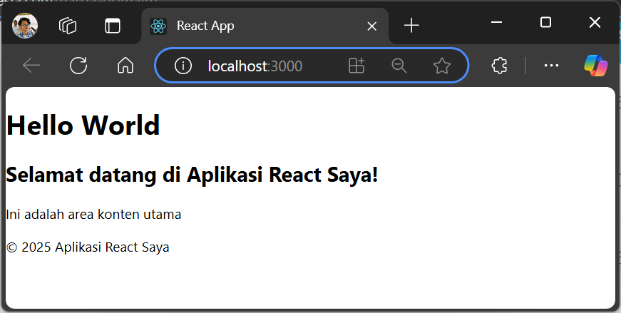
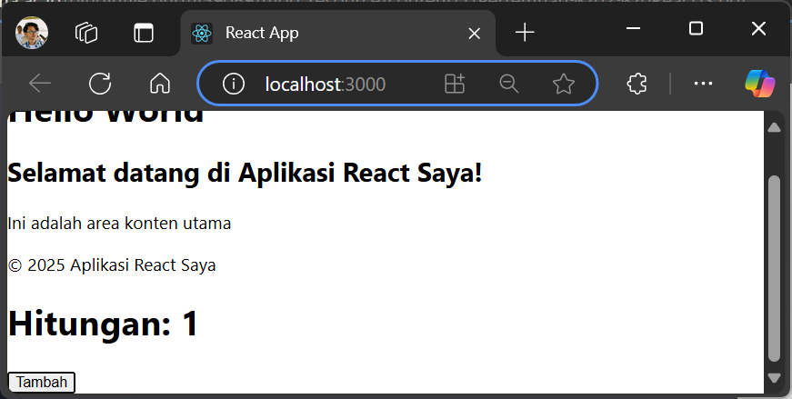
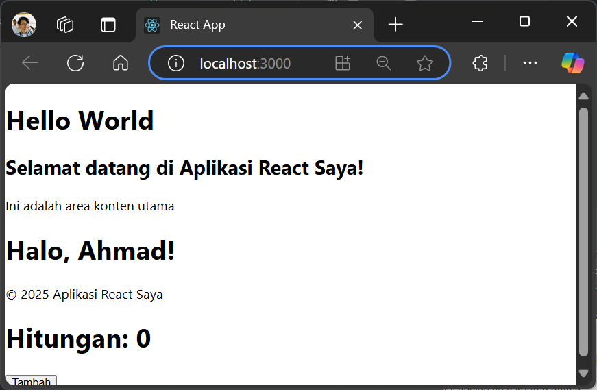
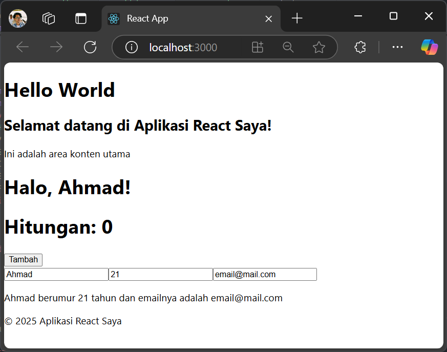
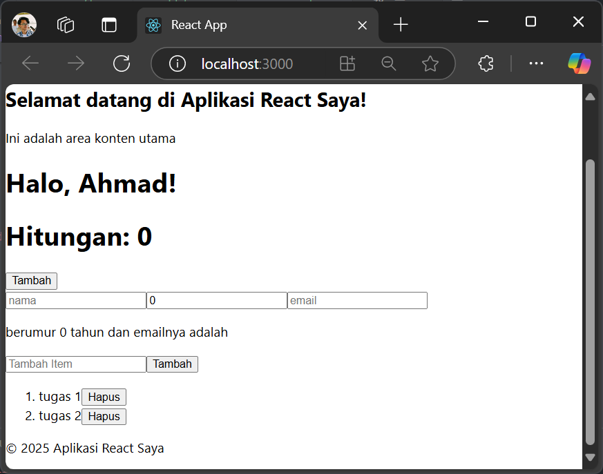

# 02 - PRAKTIKUM REACT
|           |                               |
|-----------|-------------------------------------|
| NIM       | 2241720207                          |
| Nama      | Ahmad Taufiq Hidayatulloh                  |
| Kelas     | TI - 3C                             |

## PRAKTIKUM
### Membuat Komponen React
Kode Program `App.js`:
```
import React from 'react';

function Header(){
  return(
    <header>
      <h1>Hello World</h1>
    </header>
  )
}

function Main(){
  return(
    <main>
      <h2>Selamat datang di Aplikasi React Saya!</h2>
      <p>Ini adalah area konten utama</p>
    </main>
  )
}

function Footer(){
  return(
    <footer>
      <p>&copy; 2025 Aplikasi React Saya</p>
    </footer>
  )
}

function App() {
  return (
    <div>
      <Header />
      <Main />
      <Footer />
    </div>
  );
}

export default App;
```

Hasil tampilan:



### Menggunakan JSX untuk Membuat Komponen Dinamis
Kode Program `Counter.js`:
```
import React from 'react';

function Counter() {
    const [count, setCount] = React.useState(0);

    function handleClick() {
        setCount(count + 1);
    }
  return (
    <div>
        <h1>
            Hitungan: {count}
        </h1>
        <button onClick={handleClick}>Tambah</button>
    </div>
  )
}

export default Counter;
```
Tambahan Kode Program `App.js`:
```
import Counter from './Counter';

function App() {
  return (
    <div>
      <Header />
      <Main />
      <Footer />
      <Counter/>
    </div>
  );
}
```

Hasil tampilan:



### Menggunakan Props untuk Mengirim Data

Kode Program `Greeting.js`:
```
import React from 'react'

function Greeting(props) {
  return (
    <h1>Halo, {props.name}!</h1>
  )
}

export default Greeting
```

Tambahan Kode Program `App.js`:
```
import Greeting from './Greeting';

function App() {
  return (
    <div>
      <Header />
      <Main />
      <Greeting name="Ahmad" />
      <Footer />
      <Counter/>
    </div>
  );
}
```

Hasil tampilan:



### Menggunakan State untuk Mengelola Data

Tambahan Kode Program `App.js`:
```
import React, { useState } from 'react';

function App() {
  const [name, setName] = useState('');
  const [age, setAge] = useState(0);
  const [email, setEmail] = useState('');

  const handleNameChange = (e) => {
    setName(e.target.value);
  }

  const handleAgeChange = (e) => {
    setAge(e.target.value);
  }

  const handleEmailChange = (e) => {
    setEmail(e.target.value);
  }

  return (
    <div>
      <input type='text' placeholder='nama' value={name} onChange={handleNameChange} />
      <input type='number' placeholder='umur' value={age} onChange={handleAgeChange} />
      <input type='email' placeholder='email' value={email} onChange={handleEmailChange} />
      <p>{name} berumur {age} tahun dan emailnya adalah {email}</p>
    </div>
  )
}
```

Hasil tampilan:



## TUGAS

Kode Program `ToDoList.js`:
```
import { useState } from "react";

function ToDoList() {
    const [todoList, setTodoList] = useState([]);
    const [inputValue, setInputValue] = useState("");

    const handleAddTodo = () => {
        if (inputValue.trim() !== "") {
            setTodoList([...todoList, inputValue]);
            setInputValue(""); 
        }
    };

    return (
        <div>
            <input
                type="text"
                placeholder="Tambah Item"
                value={inputValue}
                onChange={(e) => setInputValue(e.target.value)}
            />
            <button type="submit" onClick={handleAddTodo}>Tambah</button>
            <ol>
                {todoList.map((item, idx) => (
                    <li key={idx}>
                        {item} 
                        <button onClick={() => setTodoList(todoList.filter((_, index) => index !== idx))}>
                            Hapus
                        </button>
                    </li>
                ))}
            </ol> 
        </div>
    );
}

export default ToDoList;
```

Hasil tampilan:

