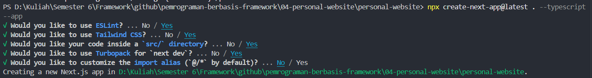
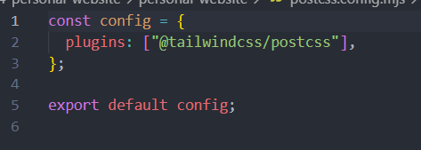
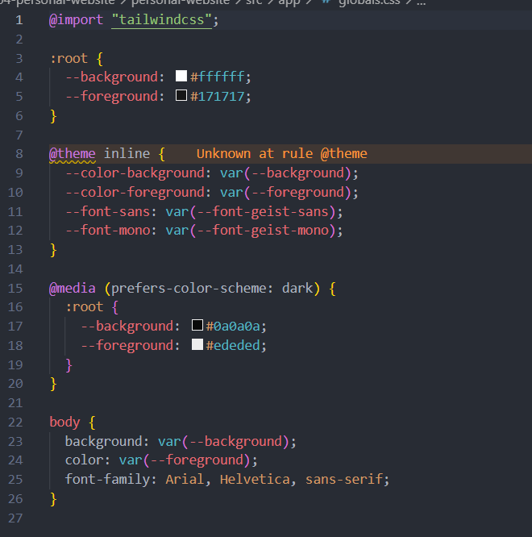

# 04 - Membangun Personal Website
|           |                               |
|-----------|-------------------------------------|
| NIM       | 2241720207                          |
| Nama      | Ahmad Taufiq Hidayatulloh                  |
| Kelas     | TI - 3C                             |

## PRAKTIKUM
### Persiapan Praktikum
Create Project:



Konfigurasi postcss.config.mjs:


File global.css:


Run Project:


### Membuat Halaman dengan Server-Side Rendering (SSR)

Kode Program `pages/index.tsx`:
```
import React from 'react'

const HomePage = () => {
  return (
    <div>
      <h1>Selamat Datang di Website Saya!</h1>
      <p>Ini adalah halaman utama.</p>
    </div>
  )
}

export default HomePage
```

Hasil tampilan:


### Menggunakan Static Site Generation (SSG)

Kode Program `pages/blog.js`:
```
import React from 'react'

const Blog = ({ posts }) => {
    return (
        <div>
            <h1>Blog Saya</h1>
            {posts.map((post => (
                <div key={post.id}>
                    <h2>{post.title}</h2>
                    <p>{post.body}</p>
                </div>
            )))}
            <p>Ini adalah halaman utama.</p>
        </div>
    )
}

export async function getStaticProps() {
    const res = await fetch('https://jsonplaceholder.typicode.com/posts')
    const posts = await res.json()
    return {
        props: {
            posts
        }
    }
}

export default Blog
```

Hasil tampilan:


### Menggunakan Dynamic Routes

Kode Program `pages/blog/[slug].js`:
```
import {useRouter} from 'next/router';

const BlogPost = () => {
    const router = useRouter();
    const {slug} = router.query;

    return (
        <div>
            <h1>Blog Post: {slug}</h1>
            <p>Ini adalah blog post dengan slug {slug}</p>
        </div>
    )
}

export default BlogPost;
```

Hasil tampilan:


### Menggunakan API Routes

Kode Program `pages/api/product.js`:
```
export default async function handler(req, res) {
    const response = await fetch('https://jsonplaceholder.typicode.com/products');
    const products = await response.json();

    res.status(200).json(products);
}
```

Kode Program `pages/products.js`:
```
import { useState, useEffect } from 'react'

const ProductList = () => {
    const [products, setProducts] = useState([])

    useEffect(() => {
        const fetchProducts = async () => {
            const response = await fetch('/api/products')
            const products = await response.json()
            console.log("ANU" +products)
            setProducts(products)
        }
        fetchProducts()
    }, [])

    return (
        <div>
            <h1>Daftar Produk</h1>
            <ul>
                {products.map((product) => (
                    <li key={product.id}>{product.title}</li>)
                )}
            </ul>
        </div>
    )
}

export default ProductList
```

Hasil tampilan:


### Menggunakan Link Component

Tambahan Kode Program `pages/index.tsx`:
```
import Link from 'next/link'

const HomePage = () => {
  return (
    <div>
      <h1>Selamat Datang di Website Saya!</h1>
      <p>Ini adalah halaman utama.</p>
      <Link href="/about">Tentang Kami</Link>
    </div>
  )
}

export default HomePage
```

Kode Program `pages/about.js`:
```
const About = () => {
    return (
        <div>
            <h1>Tentang Kami</h1>
            <p>Kami adalah perusahaan yang mengkhususkan diri dalam pembuatan website berkualitas tinggi.</p>
        </div>
    )
}

export default About
```

Hasil tampilan index:


Hasil tampilan about: 


## TUGAS
### Soal 1
Buat halaman baru dengan menggunakan Static Site Generation (SSG) yang menampilkan daftar pengguna dari API https://jsonplaceholder.typicode.com/users.

Kode Program 'pages/users/index.js':
```
export async function getStaticProps() { 
    const res = await fetch('https://jsonplaceholder.typicode.com/users');
    const users = await res.json();
    return { props: { users } };
}

export default function UsersPage({ users }) {
    return (
        <div>
            <h1>Users</h1>
            <ul>
                {users.map((user) => (
                    <li key={user.id}>
                        <Link href={`/users/${user.id}`}>{user.name}</Link>
                    </li>
                ))}
            </ul>
        </div>
    );
}
```

Hasil tampilan:


### Soal 2
Implementasikan Dynamic Routes untuk menampilkan detail pengguna berdasarkan ID!

Kode Program 'pages/users/[id].js':
```
import { useRouter } from 'next/router';

export async function getStaticPaths() {
    const res = await fetch('https://jsonplaceholder.typicode.com/users');
    const users = await res.json();

    const paths = users.map(user => ({
        params: { id: user.id.toString() },
    }));

    return { paths, fallback: false };
}

export async function getStaticProps({ params }) {
    const res = await fetch(`https://jsonplaceholder.typicode.com/users/${params.id}`);
    const user = await res.json();

    return { props: { user } };
}

export default function Detail({ user }) {
    return (
        <div>
            <h1>{user.name}</h1>
            <p><strong>Username:</strong> {user.username}</p>
            <p><strong>Email:</strong> {user.email}</p>
            <p><strong>Phone:</strong> {user.phone}</p>
            <p><strong>Website:</strong> {user.website}</p>
            <h2>Address</h2>
            <p>{user.address.street}, {user.address.suite}, {user.address.city}, {user.address.zipcode}</p>
            <p><strong>Geo:</strong> Lat {user.address.geo.lat}, Lng {user.address.geo.lng}</p>
            <h2>Company</h2>
            <p><strong>Name:</strong> {user.company.name}</p>
            <p><strong>CatchPhrase:</strong> {user.company.catchPhrase}</p>
            <p><strong>Business:</strong> {user.company.bs}</p>
        </div>
    );
}
```

Hasil tampilan:


### Soal 3
Buat API route yang mengembalikan data cuaca dari API eksternal (misalnya, OpenWeatherMap) dan tampilkan data tersebut di halaman front-end.